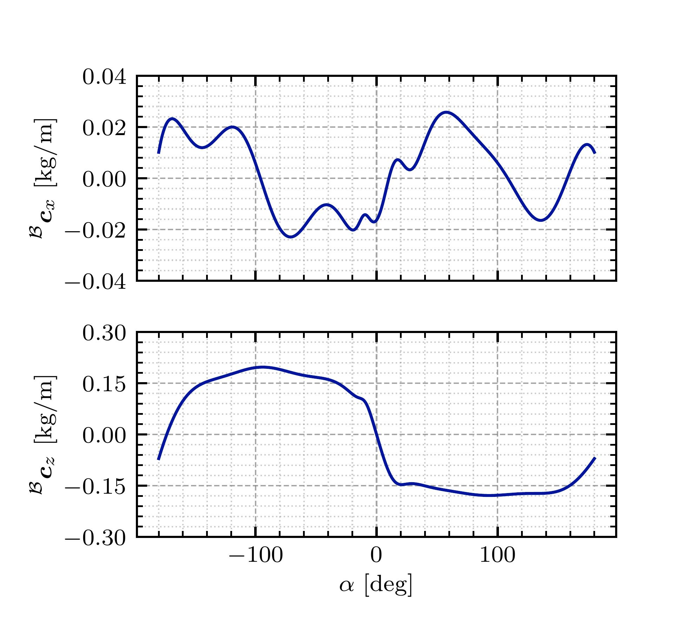

#Issues

- [ ] There is a naming error in this project. why named as hilab_plot as a python package?, though as a file folder, it can be named as hilab_plot, but as a project, it should be named as an official name, like `sciplots`

when saved plots, fig and axes should be created in a the same plotting function routine ?[Weird].

# Attraction

## Simple code like this

```python
with plt.style.context(["ieee", "latex", "ticks-inward"]):
    fig, axs = initialize_figure()
    alpha_deg, cx, cz = AeroDataLoaderInstance.get_data()
    axs[0].plot(alpha_deg, cx)
    axs[1].plot(alpha_deg, cz)
    axs[1].set_xlabel(r"$\alpha~[\mathrm{deg}]$")
    axs[0].set_ylabel(r"$\prescript{\mathcal{B}}{}{\boldsymbol{c}_x}~[\mathrm{kg/m}]$")
    axs[1].set_ylabel(r"$\prescript{\mathcal{B}}{}{\boldsymbol{c}_z}~[\mathrm{kg/m}]$")
    # finetuning
    for ax in axs:
        hilab_plot.set_minor_ticks_style(ax)

    # set ticks points for first plot (cx)
    axs[0].set_yticks([-0.04, -0.02, 0, 0.02, 0.04])
    # Set minor ticks for y-axis (4 between each major tick)
    major_spacing = 0.02  # Distance between major ticks
    minor_spacing = major_spacing/5  # 4 minor ticks between majors
    axs[0].yaxis.set_minor_locator(MultipleLocator(minor_spacing))


    # seting x ticks lable false
    axs[0].set_xticklabels([])

            # set ticks points for second plot (cz)
    axs[1].set_yticks([-0.3, -0.15, 0, 0.15, 0.3])
    # Set minor ticks for y-axis (4 between each major tick)
    major_spacing = 0.15  # Distance between major ticks
    minor_spacing = major_spacing/5  # 4 minor ticks between majors
    axs[1].yaxis.set_minor_locator(MultipleLocator(minor_spacing))

    fig.savefig(os.path.join(figures_dir, "figure-aero-lyu.pdf"), backend="pgf")
```

可以直接出 publication-quality 图片如下



# Details

## ORIGINAL PACKAGE

This package is originally from [scienceplots](https://github.com/garrettj403/SciencePlots).

## Examples

```sh
python examples/plot-examples.py
```

it will generate the figures in the `examples/figures` directory.

## Build in Editable Mode

```sh
pip install --user -e .
```

### Trouble shooting

you may have a problem with setuptools, try to upgrade it

```sh
pip install --upgrade pip setuptools setuptools_scm
```

## Goal

modify the original package to better support the IEEE style and my own aesthetic.

pip install -e .

## Dependencies

```sh
sudo apt-get install ttf-mscorefonts-installer
```

### Optional

#### 中文支持

Uh! 这里需要安装 texlive-full 去获得中文支持
This coulbe be uncessary but it is safe to install it if you have enough disk space.

```sh
sudo apt install texlive-full
```

#### Trouble shooting

if you suffer that `Pregenerating ConTeXt MarkIV format. This may take some time... takes forever`
please check the following:
(Just entering all the time until it get unstuck)[https://askubuntu.com/questions/956006/pregenerating-context-markiv-format-this-may-take-some-time-takes-forever]

texlive-xetex

```sh
sudo apt install texlive-xetex
```

#### pdf2jpg or png

```sh
pip install pdf2image Pillow
```

## Cautions

### Fonts

（SimSun）宋体似乎是微软 office 的默认字体（专用），普通的下载方式似乎没法正常安装，或者需要去盗版网站下载，
这里采用`Source Han Serif 思源宋体`作为替代。其实与微软宋体相比, 有一些不同。

[思源宋体](https://source.typekit.com/source-han-serif/cn/)

```sh
curl -L https://github.com/adobe-fonts/source-han-serif/releases/download/2.003R/14_SourceHanSerifCN.zip -o source-han-serif.zip
```

```sh
unzip source-han-serif.zip
mkdir -p ~/.fonts
cp SubsetOTF/CN/* ~/.fonts/
fc-cache -fv
```

Verify the installation:

```sh
fc-list | grep "Source Han Serif"
```

_Update_ 本项目增加了一个 simsum.tcc，
可以直接使用微软宋体(only 学术交流). 默认的 latex-sc.mplstyle 使用的是微软宋体(SimSun).

```sh
cp simsum.tcc ~/.fonts/
fc-cache -fv
```

Verify the installation:

```sh
fc-list | grep "SimSun"
```

### The interaction between matplotlib and latex

These other special characters are also escaped in non-math TeX, while in Matplotlib their behavior is dependent on how `rcParams["text.usetex"]` (default: False) is set:

```python
# $ % & ~ _ ^ \ { } \( \) \[ \]
```

### Math font

似乎 latex 是根据 text font family 自动选择了 math font family.

Observations

- mathbf 与 textbf 一致 （Roman characters; not greek letters）mathrm 与 textrm 一致
- 普通的 italic math 字符又与 textit 不一样
- boldsymbol 加粗的字体依据 italic math，而与 mathbf、mathrm 不一样
- 思源宋体似乎比较适配所有需求

# Customize the rcParams

(Customizing Matplotlib with style sheets and rcParams)[https://matplotlib.org/stable/users/explain/customizing.html]
